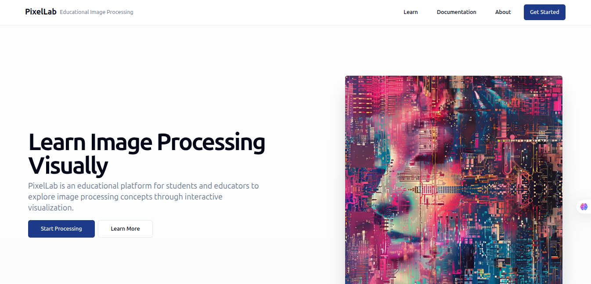
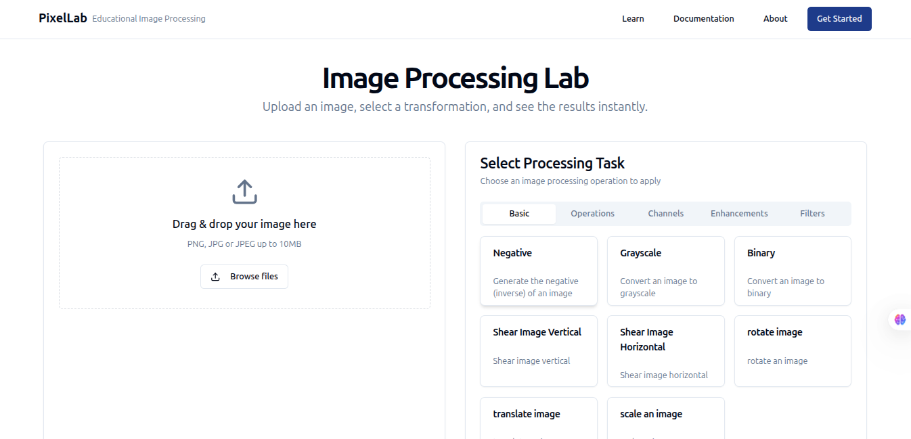
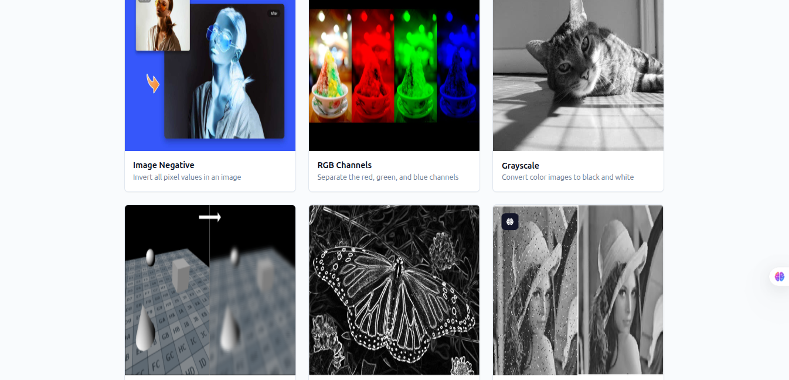

# 🎨 PixelLab – Interactive Image Processing Platform

PixelLab is an educational platform designed for students and educators to **explore image processing concepts** through **interactive visualizations**. It allows users to upload images, apply transformations with a click, and compare results side by side to intuitively understand how each technique works.

---

## 🚀 Features

- 📷 **Image Upload**: Easily upload images from your local machine.
- ⚙️ **Interactive Processing**: Apply a wide range of OpenCV transformations such as:
  - Image Negative
  - RGB Channel Separation
  - Grayscale Conversion
  - Gaussian Blur
  - Sobel Edge Detection
  - Noise Removal
- 🧠 **Visual Learning**: Side-by-side comparison of original and transformed images.
- ☁️ **Cloud Processing**: Images are processed in real time using OpenCV on Azure.
- 📦 **Dockerized Architecture**: Fully containerized using Docker for smooth deployment.

---

## 🖼️ Screenshots

### 🏠 Home Page  


### 📤 Image Upload  


### ⚙️ Processing Options  



## 🛠️ Tech Stack

### 🔧 Frontend

- [Next.js](https://nextjs.org/)
- [React](https://reactjs.org/)
- [Vite](https://vitejs.dev/)
- [TypeScript](https://www.typescriptlang.org/)
- [Tailwind CSS](https://tailwindcss.com/)
- [ShadCN UI](https://ui.shadcn.com/)

### 🔩 Backend

- [FastAPI](https://fastapi.tiangolo.com/)
- [OpenCV](https://opencv.org/)
- Hosted on [Azure Cloud](https://azure.microsoft.com/)
- Containerized with [Docker](https://www.docker.com/)

---

## 🧰 Installation

### Prerequisites

- Node.js (>= 18)
- Python (>= 3.9)
- Docker & Docker Compose

### Frontend Setup

```bash
cd frontend
npm install
npm run dev

``` 
### PixelLab/
│
├── frontend/            
├── backend/             
├── docker-compose.yml   
├── screenshots/         
└── README.md
